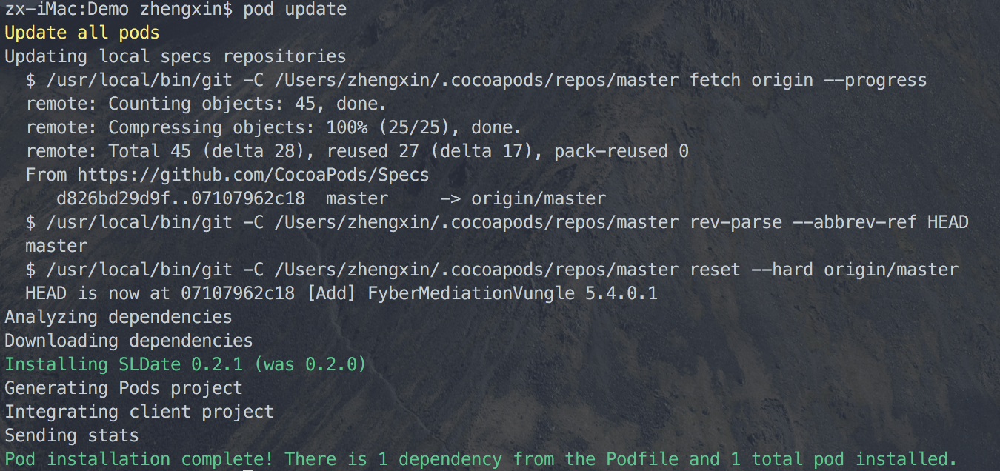

# 通过CocoaPods方式打包framework

[//]: #[](https://cocoapods.org/pods/SLDate)
[//]: #[](https://cocoapods.org/pods/SLDate)
[//]: #[](https://cocoapods.org/pods/SLDate)

### 通过`pod lib`命令创建项目

* `pod lib create project-name` 创建项目.

```shell
pod lib create SLDate
```


* 创建后打开工程,看一下工程文件.


### 把你想要打包的文件放到路径下

* 框架的源码文件放到 `Classes` 下,路径千万别搞错.
* 图片资源文件放到 `Assets` 下,需要在 `s.resource` 额外添加.


### 编辑 `*.podspec` 文件

```cocoapods
Pod::Spec.new do |s|
  s.name             = 'SLDate'
  s.version          = '0.2.0'
  s.summary          = 'SLDate is a NSDate Category.'

  s.description      = <<-DESC
TODO: Add long description of the pod here.
                       DESC

  s.homepage         = 'https://github.com/yangbryant/CocoaPods_framework_tutorial'
  # s.screenshots     = 'www.example.com/screenshots_1', 'www.example.com/screenshots_2'
  s.license          = { :type => 'MIT', :file => 'LICENSE' }
  s.author           = { 'Srefan' => 'liyangkobebryant@hotmail.com' }
  s.source           = { :git => '/Users/zhengxin/gitlab/Others/CocoaPods_framework_tutorial', :tag => s.version.to_s }

  s.ios.deployment_target = '8.0'

  s.source_files = 'SLDate/Classes/*.{h,m}'
  
  s.resource_bundles = {
    'SLDate' => ['SLDate/Assets/*.png']
  }

  # s.public_header_files = 'Pod/Classes/**/*.h'
  s.frameworks = 'UIKit'
  
  # 如果你的库使用了其他第三方库，需要加入
  # s.dependency 'AFNetworking', '~> 2.3'
end
```

### Lint PodSpec文件的规则

```shell
pod lib lint SLDate.podspec --allow-warnings
```

* `--allow-warnings` 忽略警告信息
* `--use-libraries` 针对引用依赖了第三方Pod库


### 导入文件到项目内

* 切换到 `Example` 路径下,执行 `update` 操作.

```shell
cd Example
pod update --verbose --no-repo-update
```


* 更新后再看一下工程文件.


### 本地提交代码

```shell
# 提交代码
git commit -m "v0.1.0"
# 创建tag
git tag -a 0.1.0 -m "v0.1.0"
```

### 打包framework

> 打包需要使用 `CocoaPods` 的`package`插件, [安装方法](https://github.com/CocoaPods/cocoapods-packager).

```shell
pod package SLDate.podspec --force # 打包成framework
```

* `pod package SLDate.podspec --library --force` 打包成 `.a` 文件.


### 生成framework外链

* 压缩framework成`zip`包, 上传生成外链.


### 编辑 `*.PodSpec` 文件

* _注意_: 此podspec文件是打包后的podspec文件,不是创建项目的那个.

```CocoaPods
Pod::Spec.new do |s|
  s.name = "SLDate"
  s.version = "0.2.0"
  s.summary = "SLDate is a NSDate Category."
  s.license = {"type"=>"MIT", "file"=>"LICENSE"}
  s.authors = {"Srefan"=>"liyangkobebryant@hotmail.com"}
  s.homepage = "https://github.com/yangbryant/CocoaPods_framework_tutorial"
  s.description = "TODO: Add long description of the pod here."
  s.frameworks = "UIKit"
  s.source = { :http => 'https://github.com/yangbryant/CocoaPods_framework_tutorial/releases/download/0.2.0/SLDate.zip' }
  s.platform = :ios

  s.ios.deployment_target    = '8.0'
  s.ios.vendored_framework   = 'SLDate.framework'
end
```

### Lint PodSpec文件的规则

* 同样要 `Lint` 下规则, 还是打包后的文件.

```shell
cd SLDate-0.2.0/
pod spec lint SLDate.podspec --allow-warnings
```

### 提交到 `Pod`

```shell
pod trunk push --allow-warnings
```


### 搜索我的库

```
pod search SLDate
```


### 创建`Demo`项目,用`Pod`导入库

* `pod init`创建 `PodFile`文件

```CocoaPods
# Uncomment the next line to define a global platform for your project
source 'https://github.com/CocoaPods/Specs.git'
platform :ios, '8.0'
use_frameworks!
inhibit_all_warnings!

target 'Demo' do
pod 'SLDate'
end
```



### 项目中调用


### OK, 成功了, Finished!


## License

SLDate is available under the MIT license. See the LICENSE file for more info.
